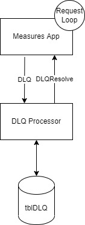

> The implementation you’ve done here is an MVP. While testing your application, you find that the
external system where your requests are sent is very unstable! We are required to guarantee that
the contents of the external system’s database match the data files that your application ingests,
thus your application needs to account for intermittent request failures. Write a brief, maximum
one page document that outlines your approach to meeting this requirement.

The answer to this depends on the technology available.  If I had free reign I would implement a retry loop with an exponential back off (the amount of retries and backoff time depending on the amount of requests, number of pods, etc) and a Dead Letter Queue.  

If the request hit the max retries, I would then write the data to a DLQ topic via Kafka.  

A separate application would process the message and store the message in a Database.  An API within this application would allow for the replay of the message.  Alternatively (or in tandem) a timer could be set on the application to process the DLQ every hour (or however long deemed necessary) to automatically retry the messages.

The Measures application would set up an agent to consume from the DLQResolve topic and then start the cycle over again.

